# CMPE 172 - Final Notes

# Docker MYSQL Setup
1. First set up a mysql container in docker by running th commands

```
docker network create --driver bridge gumball

docker run -d --network gumball --name mysql -td -p 3306:3306 -e MYSQL_ROOT_PASSWORD=cmpe172 mysql:8.0
```

2. Next I manually created a database named "gumballAmount" to match my application.properties using this command"

```
docker exec -it mysql bash

mysql --password ("cmpe172")

create database gumballAmount;

connect gumballAmount;
```

# Docker Image Push
1. To push my project image onto dockerhub I used the following commands in my project directory

```
gradle clean

gradle build -x test

gradle bootJar

docker build -t spring-gumball .

docker run --network gumball -e "MYSQL_HOST=mysql" --name spring-gumball -td -p 8080:8080 spring-gumball

docker login

docker build -t juss2000/spring-gumball:latest -t juss2000/spring-gumball:latest .

docker push juss2000/spring-gumball:latest
```

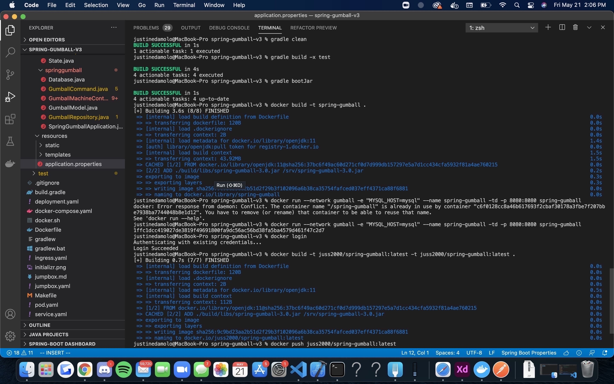
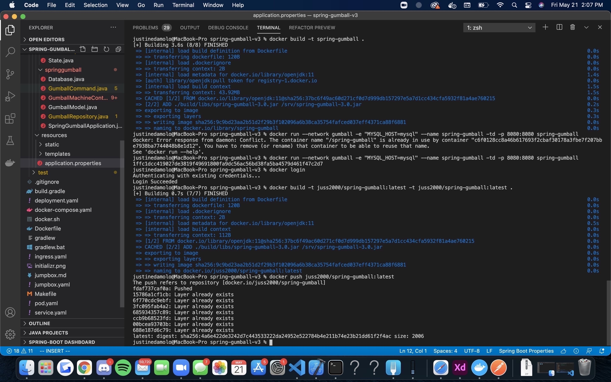
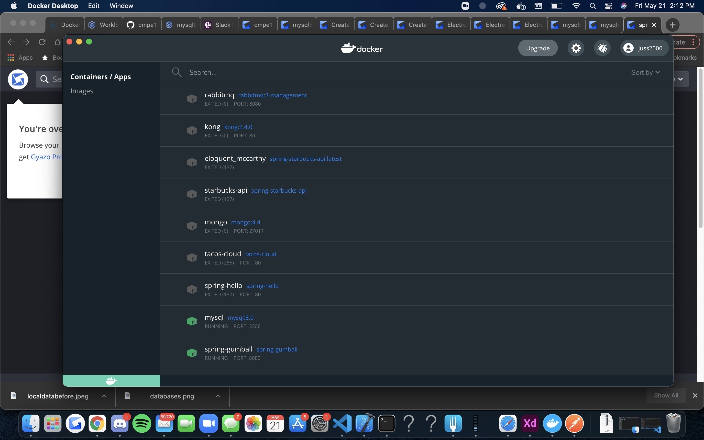
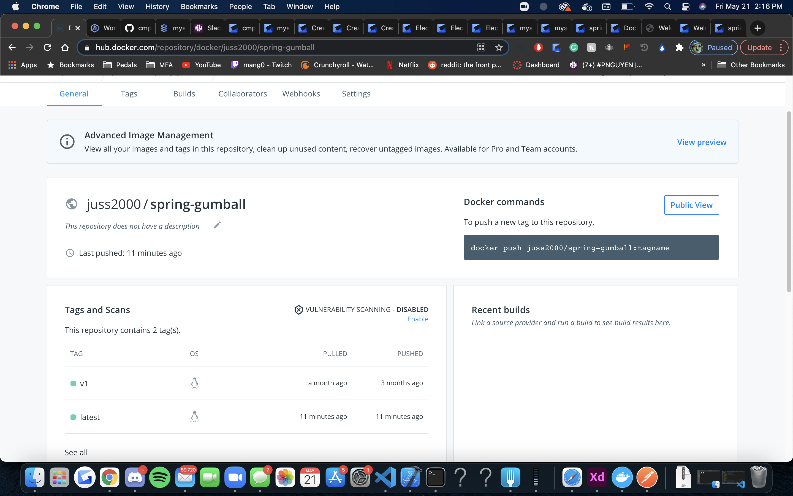

# Running locally via Docker containers
1. Gumball on localhost through Docker
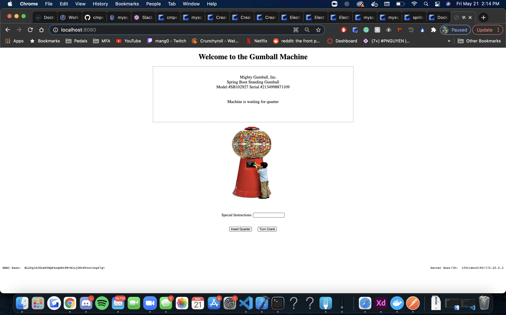
2. Database before turning crank
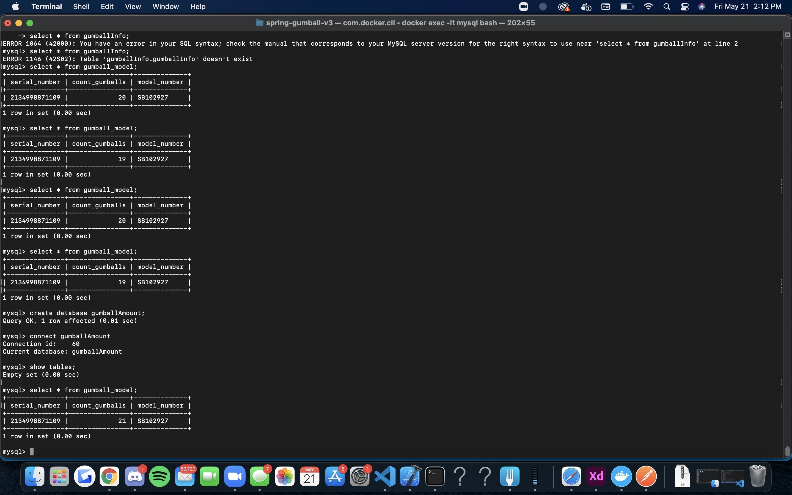
3. Database after turning crank
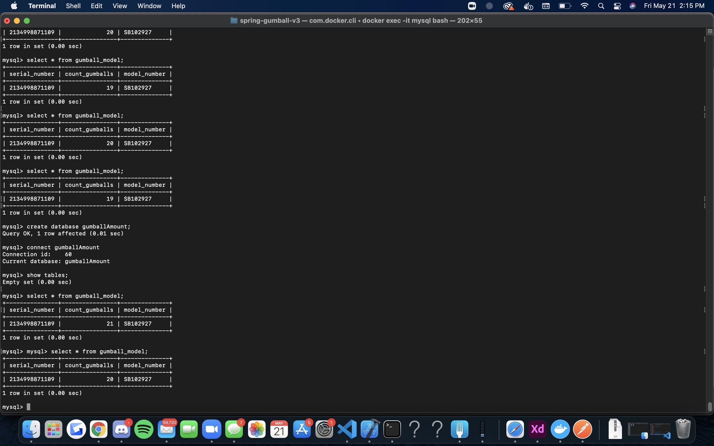

# Cloud SQL
- Create a Cloud SQL MySQL instance with the following properties:
	- Instance ID: mysql8
	- Password: cmpe172
	- Version: MySQL 8.0
	- Region: Any
	- Zone: Single Zone
	- Machine Type: Lightweight
	- Storage: SSD / 10 GB
	- Connections: Private IP
	- Network: default (VPC Native)
		- May require setting up a private service connnection
		- Enable Service Networking API
		- Use Automatic IP Range
		
1. Configuring the SQL instance
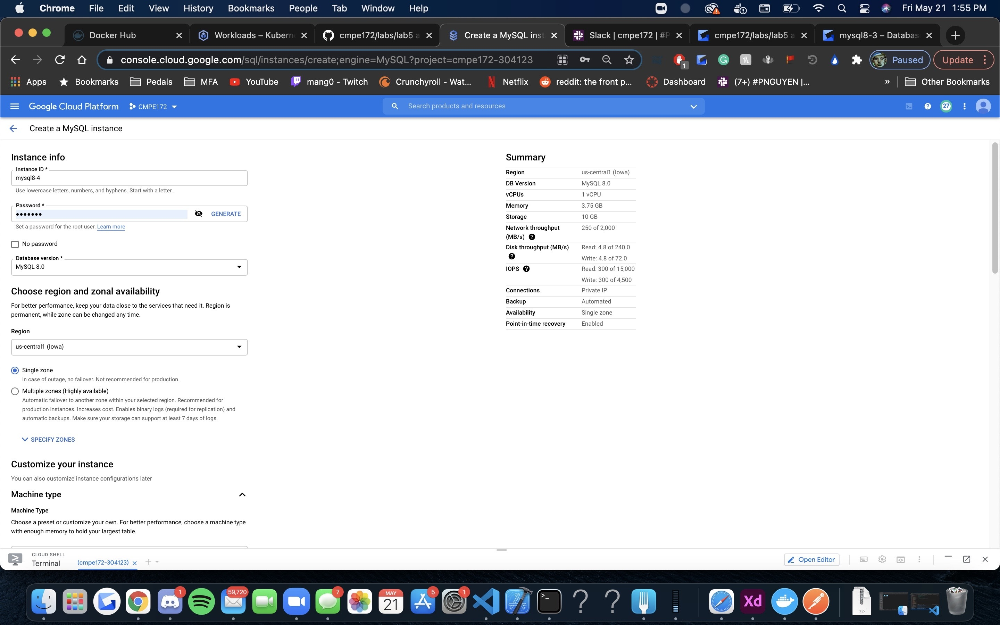
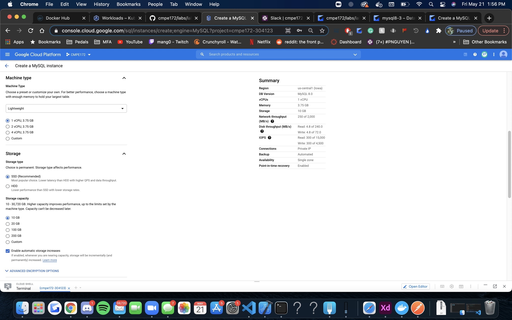
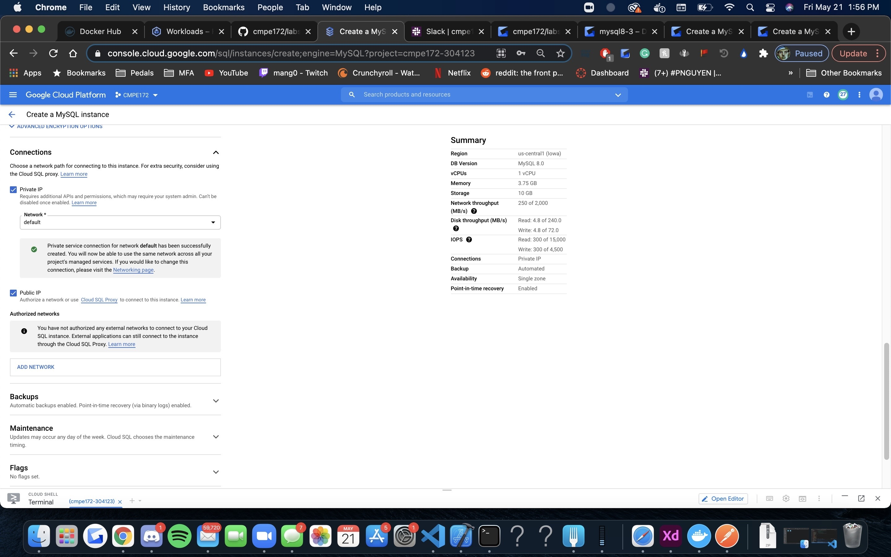

2. Cloud instance
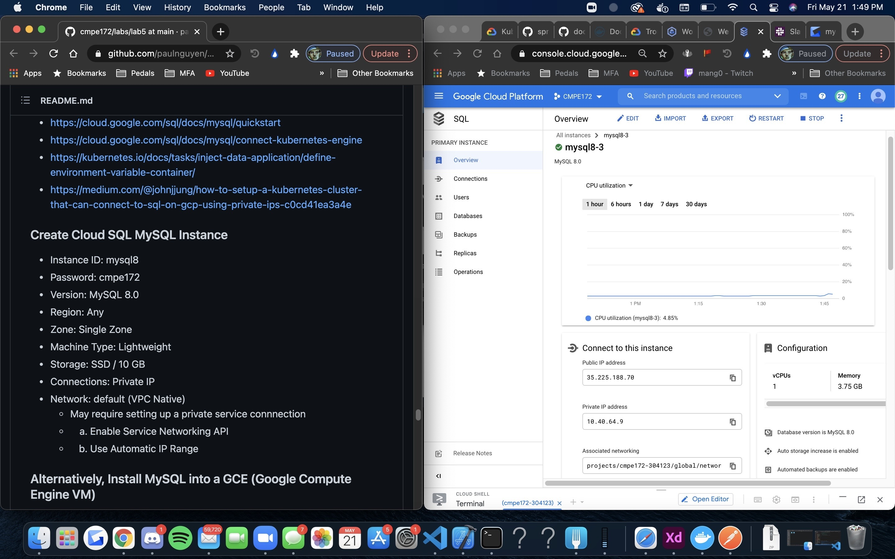

3. Database in instance
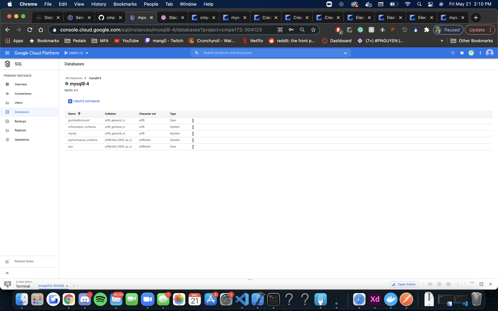


