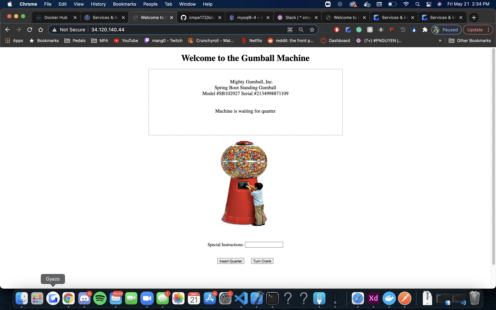

# CMPE 172 - Final Notes

# Docker MYSQL Setup
1. First set up a mysql container in docker by running th commands

```
docker network create --driver bridge gumball

docker run -d --network gumball --name mysql -td -p 3306:3306 -e MYSQL_ROOT_PASSWORD=cmpe172 mysql:8.0
```

2. Next I manually created a database named "gumballAmount" to match my application.properties using this command"

```
docker exec -it mysql bash

mysql --password ("cmpe172")

create database gumballAmount;

connect gumballAmount;
```

# Docker Image Push
1. To push my project image onto dockerhub I used the following commands in my project directory

```
gradle clean

gradle build -x test

gradle bootJar

docker build -t spring-gumball .

docker run --network gumball -e "MYSQL_HOST=mysql" --name spring-gumball -td -p 8080:8080 spring-gumball

docker login

docker build -t juss2000/spring-gumball:latest -t juss2000/spring-gumball:latest .

docker push juss2000/spring-gumball:latest
```


# Running locally via Docker containers
1. Gumball on localhost through Docker

2. Database before turning crank

3. Database after turning crank


# Cloud SQL
- Create a Cloud SQL MySQL instance with the following properties:
	- Instance ID: mysql8
	- Password: cmpe172
	- Version: MySQL 8.0
	- Region: Any
	- Zone: Single Zone
	- Machine Type: Lightweight
	- Storage: SSD / 10 GB
	- Connections: Private IP
	- Network: default (VPC Native)
		- May require setting up a private service connnection
		- Enable Service Networking API
		- Use Automatic IP Range
		
1. Configuring the SQL instance


2. Cloud instance


3. Database in instance


-Remember the private IP that is listed on the instance page.

# Modifying deployment.yaml

```
apiVersion: apps/v1
kind: Deployment
metadata:
  name: spring-gumball-deployment
  namespace: default
spec:
  selector:
    matchLabels:
      name: spring-gumball
  replicas: 4 # tells deployment to run 2 pods matching the template
  template: # create pods using pod definition in this template
    metadata:
      # unlike pod.yaml, the name is not included in the meta data as a unique name is
      # generated from the deployment name
      labels:
        name: spring-gumball
    spec:
      containers:
      - name: spring-gumball
        image: paulnguyen/spring-gumball:v3.0
        env:
        - name: MYSQL_HOST
          value: 172.22.16.7  <---- Replace this IP with the one listed on your instance page! 
        ports:
        - containerPort: 8080
```

# Deployment of Spring-Gumball to GKE
1. Create a cluster with name "cmpe172" and zone "us-central1-c"
2. Connect to the cluster on the Google command line
3. Upload your deployment.yaml, pod.yaml, service.yaml, and ingress.yaml
4. Run the necessary commands for your yaml files
```
kubectl apply -f pod.yaml

kubectl create -f deployment.yaml --save-config

kubectl create -f service.yaml

kubectl apply -f ingress.yaml
```
5. Set up your jump box using these commands
 ```
kubectl create -f jumpbox.yaml
kubectl exec -it jumpbox -- /bin/bash

apt-get update
apt-get install curl
apt-get install iputils-ping
apt-get install telnet
apt-get install httpie

apt-get update
apt-get install mysql-client 

mysql -u root -p -h 172.22.16.7 <--- Replace this with that same private IP from earlier!
 ```


6. Wait for your ingress to finish and then click on the endpoint to go to the application.


# Gumball Cloud Deployment
1. Gumball on the cloud.

2. Database before turning crank

3. Database after turning crank

